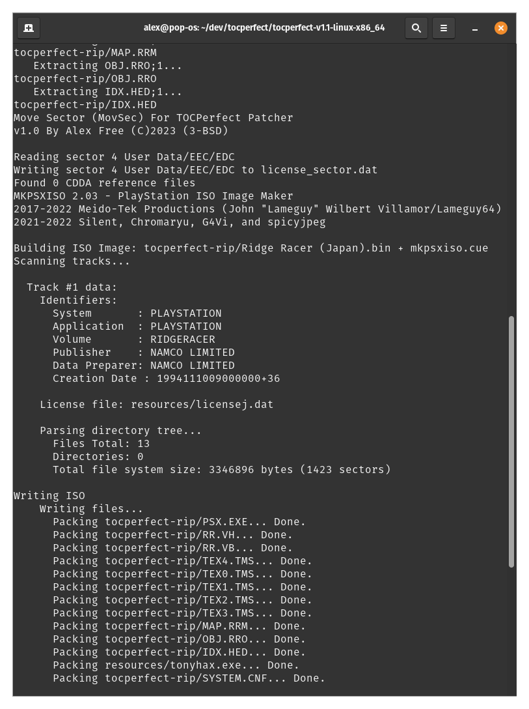

# [alex-free.github.io](https://alex-free.github.io)

# TOCPerfect

By Alex Free

The [earliest PSX consoles](#consoles-with-the-cd-player-swap-trick) are vulnerable to the [CD Player Swap Trick](#how-to-do-the-cd-player-swap-trick), the only swap trick that **does not involve swapping the real PSX game disc while it is being spun by the console**. While the CD Player Swap Trick alone is quite powerful (it allows booting imports and backups from the PSX BIOS directly), it comes with limitations. TOCPerfect patching a PSX game fixes the limitations and shows the true potential of the exploit for the first time.

_When booting a CD-R or imported PSX game disc with the CD Player Swap Trick, you can experience:_

*   Incorrect CD Audio playback. This is caused by incorrect TOC data previously retrieved from the real PSX disc is used while playing the backup or import disc.

*   Additional Anti-Piracy detection found in some later games detects the trick and locks up the game.

*   You are unable to complete some multi-disc games (i.e. Fear Effect) due to the fact that there is no way to insert the next disc during the middle of the game without unblocking the lid sensor.

*   You are unable to boot any import discs or backup CD-Rs that are not japan region games (early SCPH-3000 only is affected by this issue).

_When booting a [TOCPerfect Patched CD-R](#how-to-apply-the-tocperfect-patch) with the [CD Player Swap Trick](#how-to-do-the-cd-player-swap-trick), The [Tonyhax International Loader](https://github.com/alex-free/tonyhax-international) starts the main game executable automatically, so you instead experience:_

*   Correct CD Audio Playback.

*   Additional Anti-Piracy detection is completely defeated with Tonyhax International for all SCPH-1000 and early SCPH-3000 models. Almost every game will now also work on the early SCPH-1001 and early SCPH-3000 models as well thanks to the Tonyhax International [APv2 bypass system](https://alex-free.github.io/tonyhax-international/anti-piracy-bypass.html).

*   The ability to complete all multi-disc games (on early SCPH-1001 and early SCPH-1002 only).

*   The ability to play non-japan region games (only matters for compatible early SCPH-3000 consoles).

## Table Of Contents

*   [Downloads](#downloads)
*   [Consoles With The CD Player Swap Trick](#consoles-with-the-cd-player-swap-trick)
*   [How To Do The CD Player Swap Trick](#how-to-do-the-cd-player-swap-trick)
*   [How To Apply The TOCPerfect Patch](#how-to-apply-the-tocperfect-patch)
*   [Licenses](#licenses)
*   [Credits](#credits)

## Links

*   [Homepage](https://alex-free.github.io/tocperfect)
*   [GitHub](https://github.com/alex-free/tocperfect)
*   [Tonyhax International Homepage](https://alex-free.github.io/tonyhax-international)
*   [Tonyhax International Github](https://github.com/alex-free/tonyhax)
*   [PS1 DemoSwap Patcher](https://github.com/alex-free/ps1demoswap) - this patcher also has a TOCPerfect patch option (that works very similar but also differently then this).

## Downloads

### Version 1.1.3 (9/15/2023)

*	[tocperfect-v1.1.3-windows-x86\_64](https://github.com/alex-free/tocperfect/releases/download/v1.1.3/tocperfect-v1.1.3-windows-x86_64.zip) _For Windows 10 64-bit or newer_

*	[tocperfect-v1.1.3-linux-x86\_64](https://github.com/alex-free/tocperfect/releases/download/v1.1.3/tocperfect-v1.1.3-linux-x86_64.zip) _For x86_64 Linux Distributions_

Changes:

*   Updated MKPSXISO to latest commit (for Linux build).

*   Updated Tonyhax International to version 1.4.1.

[About Previous Versions](changelog.md).

## Consoles With The CD Player Swap Trick

Only the PSX launch console models manufactured before November 1995 are vulnerable to the exploit. This criteria includes only these console models:

*   All SCPH-1000 consoles.

*   The oldest SCPH-3000 consoles. Compatible SCPH-3000 consoles have System BIOS v1.1J and CDROM Controller VC0B (example serial number: A6956171). Incompatible SCPH-3000 consoles instead have System BIOS v2.1J and CDROM Controller VC1B (example serial number: A7543968).in rebuilding/ripping CD images

*   The oldest SCPH-1001 consoles. Compatible consoles have a serial number lower then U592XXXX (where X can be any number) according to the original Swap Trick Guide from 1996. Such consoles have either System BIOS v2.0A and CDROM Controller VC1A (example serial number: U5361469, July 1995 manufacture date) or System BIOS v2.1A and CDROM Controller VC1A (example serial number: U5860989, October 1995 manufacture date).

*   The oldest SCPH-1002 consoles. No serial number based info is available for this console model at this time. There also appears to be no date of manufacture available (like Japanese consoles), so it is truly a roll of the dice if a specific SCPH-1002 console has the CD Player Swap Trick or not. This is probably the most rare console model to find the trick in due to it's later release date being closer to the manufacture date cutoff of console models with this trick.

## How To Do The CD Player Swap Trick

1) Turn on the [compatible](#consoles-with-the-cd-player-swap-trick) PSX console with no disc inserted.

2) Start the CD player.

3) Open the PSX CD drive lid, and put in any real PSX game disc (that is the same region as your console).

4) Find something to block the lid sensor. The real PSX game disc will start and then stop spinning after a few seconds.

5) Put in your burned TOCPerfect Patched CD-R. Exit the CD Player, and wait for the Tonyhax International loader to start.

## How To Apply The TOCPerfect Patch

Download and extract the latest release of TOCPerfect. 

### On Windows

Drag and drop the `.cue` file of the game you want to patch on top of the `tocperf.bat` file in the release.

Alternatively you can open `cmd.exe` manually and execute `tocperf.bat` with the `.cue` file as the sole argument.

### On Linux 

Drag and drop the `.cue` file of the game you want to patch on top of the `tocperf` file in the release (works for most Linux distributions).

Alternatively you can open terminal manually and execute `tocperf` with the `.cue` file as the sole argument.

## Licenses

TOCPerfect Patcher itself is released under the 3-BSD license (`licenses/tocperfect.txt`). TOCPerfect Patcher uses many other software programs to accomplish it's goals, listed below:

### [MKPSXISO](https://github.com/Lameguy64/mkpsxiso) 

Version: 2.0.3 (Windows), Latest commit as of 9/15/2023 (Linux).
License: GNU GPLv2 (`licenses/mkpsxiso.txt`)

### [Tonyhax International](https://github.com/alex-free/tonyhax)

Version: 1.3.8.
License: WTFPL (`licenses/tonyhax-international.txt`)

### [PLED](https://github.com/alex-free/pled)

Version: 1.0.3
License: Unlicense (`licenses/pled.txt`)

### [EDCRE](https://github.com/alex-free/edcre)

Version: 1.0.4
License: GNU GPLv2 (`licenses/edcre.txt`)

### [BINMerge](https://github.com/putnam/binmerge)

Version: 1.0.1
License: GNU GPLv2 (`licenses/binmerge.txt`)

### [MSYS2](https://www.msys2.org/)

This is where I got GNU [Bash](https://www.gnu.org/software/bash/) and [Coreutils](https://www.gnu.org/software/coreutils/) for Windows to self-contain the bash script in all it's portable glory.

Versions: Up to date as of 8/22/2023
Licenses: GNU GPLv3

### [Python](https://www.python.org/)

Versions: 3.2 (Linux static build from https://github.com/pts/staticpython/tree/master/release), 3.11.4 (Windows).
License: PSF (`licenses/python.txt`)

### MovSec For TOCPerfect Patcher

Version: 1.0
License: 3-BSD (`licenses/movsec.txt`)

## Credits

I originally came up with this idea and released it as TOCPerfect v1.0 on 11/3/2021. MottZilla later made [PS1 DemoSwap Patcher](https://alex-free.github.io/ps1demoswap) which I then built on even more. Thanks to MottZillas improvements and my work on DemoSwap Patcher's TOCPerfect Patching mode I learned alot about how to improve the original TOCPerfect Patcher.

For the loader itself, see the [Tonyhax International Credits](https://alex-free.github.io/tonyhax-international#credits).
